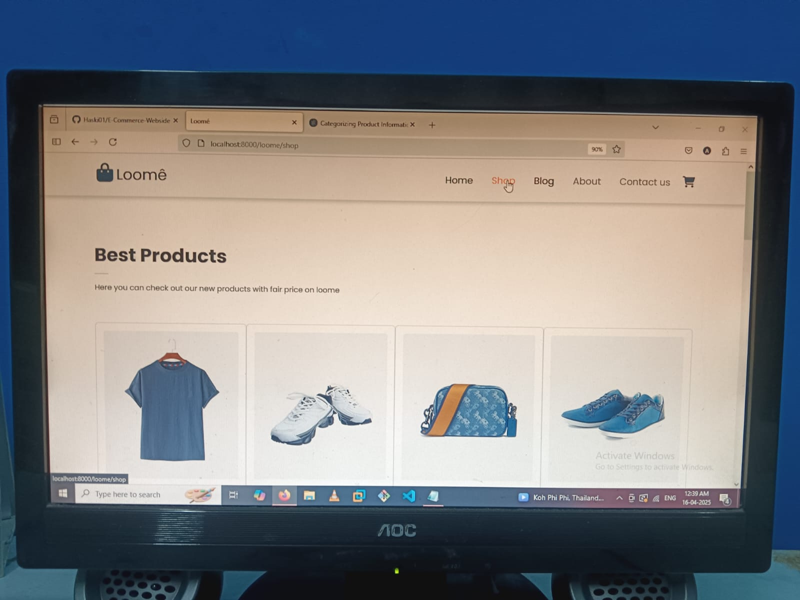
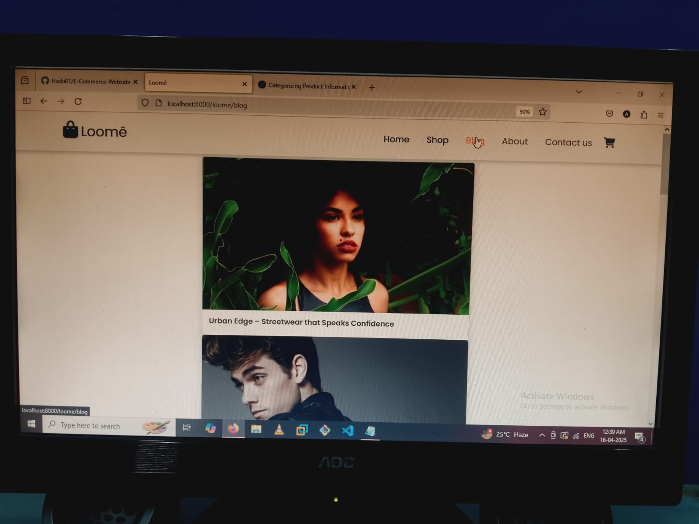
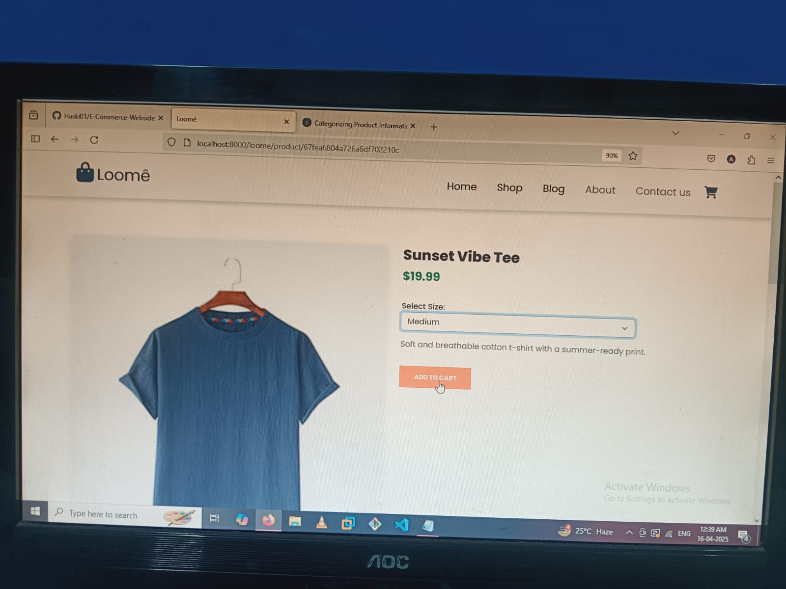
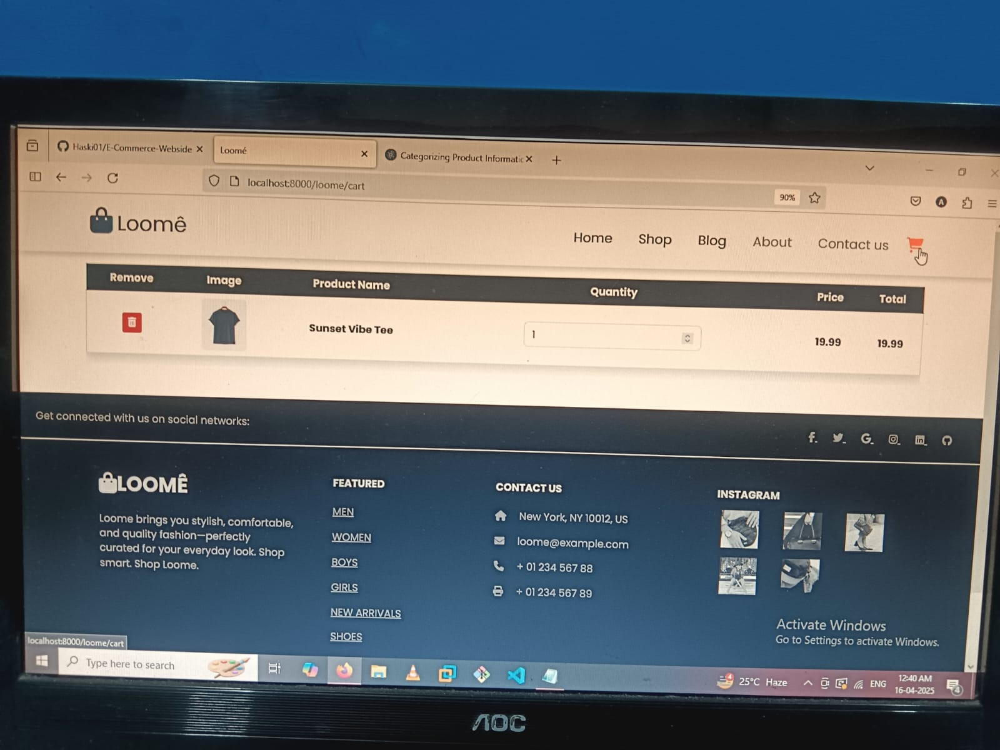

# Loome 🛍️

Welcome to **Loome**! ✨ Your one-stop modern e-commerce platform built using the powerful **MERN Stack** (MongoDB, Express, React, Node.js).
Browse products, add to cart, and enjoy a seamless shopping experience. 💳🛒

---

## 🌟 Features

### 🔐 Validations:
- **Client-Side Validation**: Ensures clean and correct input before hitting the server. 🖥️
- **Server-Side Validation**: Powered by `Joi`, keeps your database safe and your app robust. 🛡️
- **Non-existing Route Handling**: Custom 404 page for wrong URLs! 😵
- **Try-Catch Middleware**: Central error handler to manage all your "Oops!" moments gracefully. 🔁

### 🛍️ Core Features:
- **Product Listings**: Browse dynamic product pages with details. 📦
- **Add to Cart & Checkout**: Add products, view cart, and proceed to checkout. 🛒💰
- **Admin Panel**: Manage products and view orders with ease. 🧑‍💼

---

## 🚀 Technologies Used

### Frontend:
- **React.js**: For a fast and interactive UI. ⚛️
- **Bootstrap**: Responsive and stylish components. 🎨

### Backend:
- **Node.js** + **Express.js**: Robust API and server logic. 🌐
- **EJS-Mate**: Advanced EJS templating with layouts and partials. 🧩
- **Method-Override**: Support for PUT & DELETE requests in forms. ✍️

### Database:
- **MongoDB + Mongoose**: NoSQL database for flexible product & user storage. 🗃️

---

## 🎥 Demo


---

## Screenshots


---



---



---



---



---

## 🎯 How to Get Started

### 1️⃣ Prerequisites:
Make sure you have the following installed:
- [Node.js](https://nodejs.org/)
- [MongoDB](https://www.mongodb.com/)

### 2️⃣ Installation:
1. Clone the repository:
   ```bash
   git clone https://github.com/your-username/todoapp.git
   ```

2. Navigate to the project folder:
   ```bash
   cd E-COMMERCE  
   ```

3. Install dependencies for the backend:
   ```bash
   npm install
   ```

4. initialize Loome data :
   ```bash
   node initData.js
   ```

### 3️⃣ Run the Application:
1. Start the mongodb server:
   ```bash
   mongod or mannualy
   ```

2. Start the frontend server:
   ```bash
   nodemon/node index.js
   ```

3. Open your browser and navigate to `http://localhost:8000/loome`.
---

## 💡 Key Learnings
- Building a full-stack application using the MERN stack.
- Implementing both client-side and server-side validation.
- Enhancing user experience with animations and responsive design.
- Structuring a project for scalability and maintainability.

## 📌 Future Enhancements
- Add user authentication (Login/Signup).
- Implement categories or tags for tasks.
- Add dark mode. 🌙
- Integrate push notifications for task reminders. 🔔

---

## 🤝 Contributing

Contributions are always welcome! Feel free to open an issue or submit a pull request. 😊

---

## 🛠️ Tools and Resources
- **Postman**: For API testing.
- **Git**: For version control.
- **VS Code**: For coding and debugging.

---

## 📧 Contact
If you have any questions or suggestions, feel free to reach out:
- **Email**: your-email@example.com
- **GitHub**: [YourUsername](https://github.com/your-username)

---

**Thank you for checking out e-commerce loom webside! Let’s get things done! 🚀**
 ME(CSS)N-(Mongodb Express CSS & Node)  
